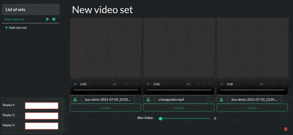

# raspberry-vlc

> Signage system based on RPI, it includes a UI to control the video players

- [raspberry-vlc](#raspberry-vlc)
  - [Live demo](#live-demo)
  - [About the project](#about-the-project)
    - [Features](#features)
  - [Deployment](#deployment)
    - [Install Node](#install-node)
    - [Install service manager PM2](#install-service-manager-pm2)
    - [Use PM2 to run the scripts as services](#use-pm2-to-run-the-scripts-as-services)
  - [Author](#author)
  - [Show your support](#show-your-support)
  - [📝 License](#-license)

## Live demo

<p align="center">
  <a href="https://raspberry-vlc.web.app/">
    
  </a>
</p> 

## About the project

RPi is a hand size computer with HDMI full HD output features, it can be used for digital signage purposes
On this repo you will find the following tools:
* Web application to select and send videos that will be played
* APIs that listen to orders made from the web application

### Features

 - You can control until 3 RPI
 - Loop videos without noticeable gaps in between
 - No internet connection dependency (Only LAN to set the videos)
 - On boot play last video played
 - It can modify the video blur
 - It creates a blur video version with `ffmpeg`
 - It plays the video with `omxplayer`

## Deployment

Clone this repo on the `/home/pi` directory with the following command

```BASH
git clone https://github.com/FrancoRosa/raspberry-vlc.git
```

### Install Node

In order to use node applications pm2 we need to install node, for this purpose we followed this tutorial:
https://www.makersupplies.sg/blogs/tutorials/how-to-install-node-js-and-npm-on-the-raspberry-pi 
Since the architecture is armv7l, we used the following commands to install node on RP3.

```BASH
sudo apt-get update
wget https://nodejs.org/dist/v14.17.0/node-v14.17.0-linux-armv7l.tar.xz
tar -xf  node-v14.17.0-linux-armv7l.tar.xz
cd node-v14.17.0-linux-armv7l/
sudo cp -R * /usr/local/
```

Then, to verify the installation 

```BASH
node -v
npm -v
```

### Install service manager PM2

To run the scripts on boot and easily monitor them, we will use `pm2`

```BASH
sudo npm install -g pm2
```

### Use PM2 to run the scripts as services

```BASH
pm2 start /home/pi/raspberry-vlc/api/disp1/index.js  -x --name "video-server"
```

```BASH
pm2 start /home/pi/raspberry-vlc/api/disp1/boot.js  -x --name "video-start"
```

Once done, lets create the start up service with the command bellow

```BASH
sudo env PATH=$PATH:/usr/local/bin pm2 startup systemd -u pi --hp /home/pi
```

Finally, save the current services to be run from boot with:

```BASH
pm2 save
```

## Author

👤 Franco Rosa
* Github: [@FrancoRosa](https://github.com/FrancoRosa)
* Linkedin: [Franco Rosa](https://www.linkedin.com/in/francoro)

## Show your support

Give a ⭐️ if you like this project!

## 📝 License

This project is [MIT](https://opensource.org/licenses/MIT) licensed.
